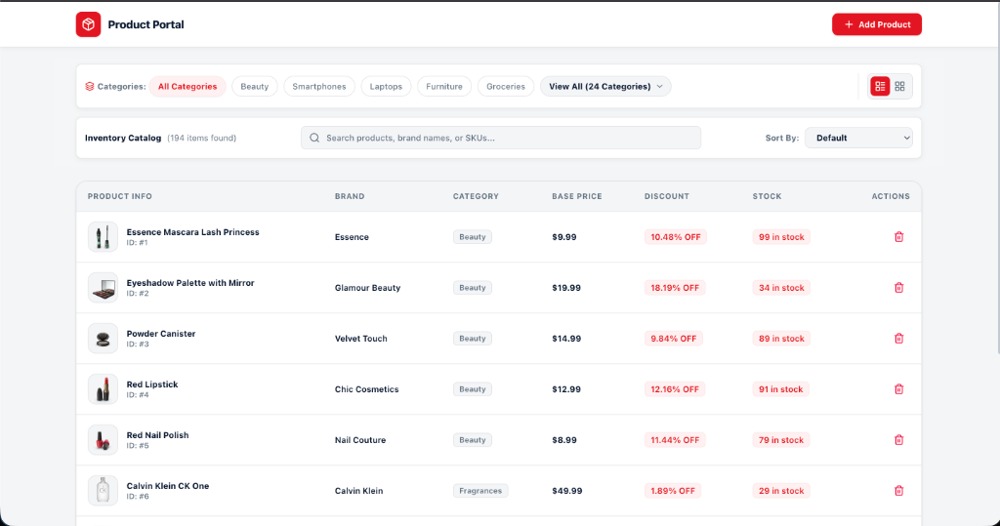
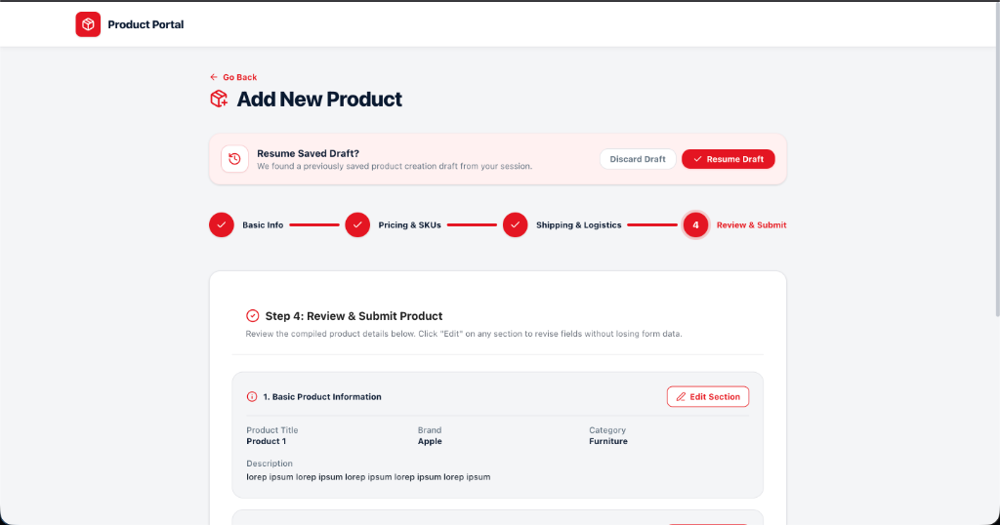

# IFG Product & Inventory Management Portal

A high-performance, enterprise-grade **Product & Inventory Management Portal** built with **Next.js 16 (App Router)**, **React 19**, **TypeScript (Strict)**, **Redux Toolkit (RTK Query)**, **React Hook Form**, **Yup**, **Tailwind CSS v4**, and **Vitest + MSW**.

---

## 🚀 Live Links & Repository

- **Public GitHub Repository**: [https://github.com/tech-azim/product-portal](https://github.com/tech-azim/product-portal)
- **Live Vercel Production URL**: [https://product-portal-tech-azim.vercel.app](https://product-portal-tech-azim.vercel.app) *(or your deployed Vercel URL)*

---

## 📸 UI & Features Preview

### 1. Inventory Directory Dashboard (`/products`)


### 2. Product Onboarding Wizard - Step 4 Review (`/products/new`)


---

## ✨ Features Overview

### Feature 1: Inventory Directory & Real-Time Sync (`/products`)
- **DummyJSON REST API Integration**: Fetches paginated inventory records, category lists, and product search results.
- **3-Way State Synchronization**: Seamless bidirectional sync between Next.js URL Search Parameters (`/products?search=phone&category=smartphones&sort=price_desc&page=2`), Redux Toolkit UI State, and RTK Query API Cache via `useProductFilters`. Refreshing or sharing the URL restores the exact catalog view.
- **Debounced Search**: 300ms input debouncing to eliminate API spamming during rapid typing.
- **Optimistic UI Updates & 20% Failure Resilience**: Instant UI updates on product updates or deletions with automatic rollback on network failure. Includes an optional **20% Failure Mode Toggle** in the header and Toast notifications with a **Retry Action** button.
- **Pure Tailwind CSS UI**: Responsive Data Table, Card Grid View toggle, Skeleton Loading states, Empty State view, and Mobile Slide-Out Filter Drawer.

### Feature 2: Multi-Step Product Onboarding Wizard (`/products/new`)
- **Step 1: Basic Information**: Title (3-100 chars), Brand, Category selector (dynamically loaded via `useGetCategoriesQuery`), Description (min 20 chars).
- **Step 2: Pricing, Stock & Dynamic SKU Variations**: Base Price (>0), Stock (>=0), Discount (0-99%), and dynamic variations array (`useFieldArray`) supporting Color, Size, SKU Code, Extra Price.
  - **Yup Validation**: Flexible SKU code format (2-50 characters) with strict unique SKU code checking across variation rows via custom Yup test.
- **Step 3: Shipping & Logistics**: Package weight (>0), Width/Height/Depth (>0), and Fragile Handling checkbox.
  - **Conditional Validation (`yup.when`)**: Checking "Requires Special Fragile Handling" enforces mandatory Hazardous Disclaimer acknowledgment and Special Shipping Notes (min 10 chars).
- **Step 4: Review & Draft Persistence**: Summary view with interactive section "Edit" buttons. Automatically preserves draft progress to Redux & LocalStorage with a prompt banner to resume saved product drafts.

### Feature 3: Automated Testing & CI/CD Pipeline
- **Yup Schema Tests**: Unit tests verifying title bounds, price limits, flexible SKU format, duplicate SKU rejection, and conditional fragile logic.
- **Redux Slice Tests**: Unit tests for `uiSlice` state transitions, `draftSlice` LocalStorage persistence, and optimistic state rollbacks.
- **Custom Hook Unit Tests**: Unit test for `useProductFilters` verifying URL searchParam initialization and 300ms debouncing.
- **Header & UI Component Unit Tests**: 100% component test coverage across forms, inputs, tables, cards, steps, toasts, and modals.
- **GitHub Actions CI Workflow**: Automated pipeline (`.github/workflows/ci.yml`) running `pnpm lint`, `pnpm test`, and `pnpm build` on every push/PR to `main`.
- **Target Coverage**: **>96%** line, statement, and function test coverage across validation schemas, helper hooks, Redux slices, and UI components.

---

## 🏗️ Technical Rationale & Architecture Answers

### 1. Race Condition Handling
**Question:** *How did you handle potential race conditions when a user types rapidly into the search input while asynchronous API requests are in flight?*

**Answer:** 
Race conditions are eliminated through a two-layer architecture:
1. **Client-Side Debouncing (300ms)**: The `useProductFilters` custom hook uses a 300ms `setTimeout` buffer before updating the debounced search state passed to RTK Query. Rapid keystrokes defer triggering API calls until typing pauses.
2. **RTK Query Request Serialization & Abort Controllers**: RTK Query automatically manages request lifecycle keys per query parameter set (`GetProductsQueryParams`). When new parameters are dispatched before an existing asynchronous HTTP request resolves, RTK Query aborts/ignores stale pending promises, ensuring only response data matching the latest query arguments is committed to the Redux cache.

### 2. State Distribution Boundaries
**Question:** *What was your architectural reasoning for separating state between Redux Toolkit, API Cache, and React Hook Form?*

**Answer:** 
State is partitioned into four distinct layers according to lifecycle, persistence scope, and re-render impact:
- **URL Search Parameters (`next/navigation`)**: Serves as the single source of truth for shareable, bookmarkable catalog views (`search`, `category`, `sort`, `page`).
- **Redux Toolkit (`uiSlice`, `productSlice`)**: Manages global client-side UI configurations (view mode preference, mobile drawer visibility, failure simulation toggle, active toast notifications) and cross-session wizard draft persistence (`localStorage`).
- **RTK Query Cache (`productsApi`)**: Serves as normalized server state handling API caching, tag-based cache invalidation, deduplication, and optimistic update patch management (`updateQueryData`).
- **React Hook Form (Local Component State)**: Encapsulates transient input field state during active form editing. Keeping step form inputs inside local component state prevents unnecessary global store dispatching and top-level page re-renders on every keystroke.

### 3. Re-render Optimization
**Question:** *What specific techniques or React patterns did you apply to prevent unnecessary re-renders in the dynamic SKU variations field array (`useFieldArray`)?*

**Answer:** 
Re-render performance in the dynamic SKU variation list is optimized using the following patterns:
1. **Stable Keys with `useFieldArray`**: Rows use `field.id` (generated by React Hook Form) as the React `key` prop instead of array indices, preventing DOM recreation when rows are added, removed, or reordered.
2. **Isolated Field Registration**: Input fields bind directly via scoped field paths (`variations.${index}.sku`). Input changes trigger targeted field updates rather than re-evaluating the entire parent wizard container.
3. **Selective Subscriptions with `useWatch`**: In Step 3, fragile shipping fields use targeted `useWatch({ name: 'requiresFragileHandling' })` subscriptions, limiting re-renders exclusively to the fragile handling container rather than re-rendering Step 1 or Step 2 fields.

### 4. Resilience Strategy
**Question:** *How did you implement state rollback for optimistic updates when API calls fail?*

**Answer:** 
Optimistic update resilience is implemented using RTK Query's `onQueryStarted` lifecycle hook in `productsApi.ts`:
1. **Optimistic Patch Application**: When a `deleteProduct` or `updateProduct` mutation is triggered, `dispatch(productsApi.util.updateQueryData(...))` immediately mutates the cached products list, providing instant UI feedback (< 16ms).
2. **Error Recovery & Patch Rollback**: The mutation promise is awaited (`queryFulfilled`). If the network request fails (or if the 20% simulated network failure mode is active), `patchResult.undo()` is immediately called in the `catch` block to restore the exact previous cache state.
3. **User Feedback & Retry Action**: An error Toast notification is dispatched containing a `retryPayload`. Clicking the **"Retry Action"** button in the Toast re-triggers the mutation with the saved payload, ensuring seamless user recovery without data loss.

---

## 🛠️ Local Setup & Run Instructions

### Prerequisites
- **Node.js**: `>= 18.17.0` (Recommended: Node 20.x)
- **Package Manager**: `pnpm` (Recommended) or `npm`

---

### 1. Installation
```bash
# Clone the repository
git clone https://github.com/tech-azim/product-portal.git
cd product-portal

# Install dependencies with pnpm (Recommended)
pnpm install

# OR using npm
npm install
```

---

### 2. Development Server
```bash
# Run Next.js Turbopack development server
pnpm dev

# OR using npm
npm run dev
```
Open [http://localhost:3000](http://localhost:3000) in your browser. The root path (`/`) automatically redirects to `/products`.

---

### 3. Running Tests & Coverage Report
```bash
# Run Vitest test suite (60 unit tests across 8 test files)
pnpm test

# OR using npm
npm run test

# Run tests with Coverage report (>96% coverage)
pnpm test:coverage
```

---

### 4. Production Build & Linting
```bash
# Run ESLint check
pnpm lint

# Compile Next.js production build
pnpm build

# Start production server
pnpm start
```
